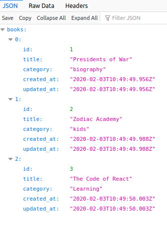

<h1 align="center">Welcome to Bookstore backend 👋</h1>

This project is a bookstore app back-end to save info on the database related with [this front-end project](https://github.com/shjang7/bookstore-frontend).



## Built With

- Ruby 2.6
- Rails 6.0
- PostgreSQL 10.10
- Rails api

### ✨ [Live Demo](https://rails-bookstore-backend-suh.herokuapp.com/)

## Getting started

> Clone the repository to your local machine

```
$ git clone https://github.com/shjang7/bookstore-backend.git
```

> Change directory into the directory

```
$ cd bookstore-backend
```

> Create database

```
$ rails db:create
```

> Migrate database

```
$ rails db:migrate
```

> Install the needed gems:

```
$ bundle install
```

> Open server

```
$ rails server
```

> Go to `http://localhost:3000` using your browser.

## Author

👤 **Suhyeon Jang**

- Github: [@shjang7](https://github.com/shjang7)
- LinkedIn: [@shjang](https://www.linkedin.com/in/shjang/)
- Twitter: [@shjang12](https://twitter.com/shjang12)

## 🤝 Contributing

Contributions, issues and feature requests are welcome!<br />Feel free to check [issues page](https://github.com/shjang7/bookstore-backend/issues).

1. Fork it (https://github.com/shjang7/bookstore-backend/fork)
2. Create your working branch (git checkout -b [choose-a-name])
3. Commit your changes (git commit -am 'what this commit will fix/add')
4. Push to the branch (git push origin feature/[feature-name])
5. Create a new Pull Request

## Show your support

Give a ⭐️ if you like this project!

## 📝 License

This project is [MIT](https://github.com/shjang7/bookstore-backend/blob/master/LICENSE) licensed.
